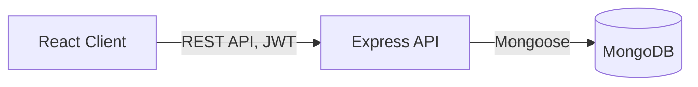
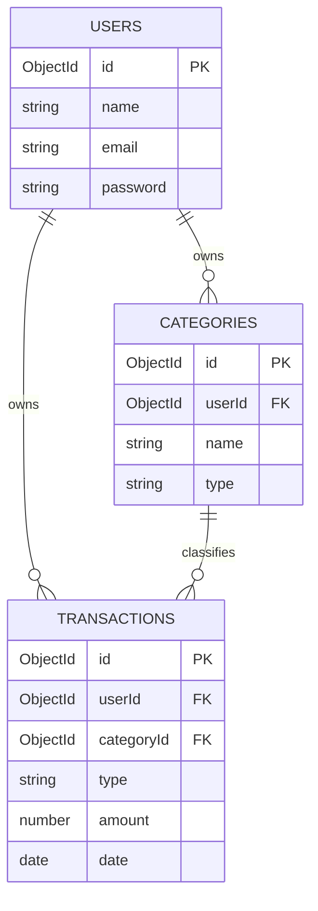

**Live app:** https://expense-tracker-xyz.vercel.app
**API health check:** https://expense-tracker-api.onrender.com/api/health

> Note: the backend is on a free tier and spins down after 15 minutes of inactivity — the first request after a while may take 30–60 seconds to respond.

# Expense Tracker — MERN Stack

A full-stack personal expense tracker with JWT authentication, protected REST APIs, and a category-based dashboard. Built with MongoDB, Express, React, and Node.

## Features

- Register / login / logout with JWT authentication
- Passwords hashed with bcrypt, never stored or returned in plaintext
- Custom income/expense categories per user
- Full transaction CRUD, scoped to the logged-in user
- Dashboard with income/expense/balance totals and a spend-by-category pie chart
- Input validation, centralized error handling, and security middleware (helmet, CORS, rate limiting) on the API
- Postman / Thunder Client-testable REST API

## Tech Stack

| Layer | Technology |
|---|---|
| Frontend | React (Vite), React Router, Axios, React Hook Form, Recharts |
| Backend | Node.js, Express, Mongoose |
| Database | MongoDB |
| Auth | JSON Web Tokens (jsonwebtoken), bcryptjs |
| Validation | express-validator |
| Security | helmet, cors, express-rate-limit |

## Architecture



A JWT is issued on login/register, stored client-side, and sent as `Authorization: Bearer <token>` on every request to a protected route. The API's `protect` middleware verifies it before any controller runs, and every query is additionally scoped to `req.user.id` so users only ever see their own data.

## Database Schema



## Folder Structure

```
expense-tracker/
├── backend/
│   ├── src/
│   │   ├── config/        # DB connection
│   │   ├── models/        # Mongoose schemas
│   │   ├── controllers/   # Route handlers
│   │   ├── routes/        # Express routers
│   │   ├── middleware/    # auth, validation, error handling
│   │   ├── utils/         # helpers (JWT signing)
│   │   ├── app.js         # Express app config
│   │   └── server.js      # Entry point
│   └── .env
├── frontend/
│   ├── src/
│   │   ├── api/           # Axios instance + endpoint wrappers
│   │   ├── components/    # Navbar, category/transaction UI
│   │   ├── context/       # AuthContext
│   │   ├── pages/         # Login, Register, Dashboard, Transactions
│   │   ├── routes/        # ProtectedRoute
│   │   └── App.jsx
│   └── .env
├── docs/
│   └── API.md
└── README.md
```

## Getting Started

### Prerequisites

- Node.js 18+
- MongoDB running locally (or a MongoDB Atlas connection string)
- npm

### 1. Clone and install

```bash
git clone https://github.com/<your-username>/expense-tracker.git
cd expense-tracker

cd backend
npm install

cd ../frontend
npm install
```

### 2. Configure environment variables

**`backend/.env`**

| Variable | Description | Example |
|---|---|---|
| `PORT` | API server port | `5000` |
| `MONGO_URI` | MongoDB connection string | `mongodb://127.0.0.1:27017/expense-tracker` |
| `JWT_SECRET` | Secret used to sign JWTs — use a long random string | `change_this_to_a_long_random_string` |
| `JWT_EXPIRES_IN` | Token lifetime | `7d` |
| `NODE_ENV` | Environment | `development` |
| `CLIENT_URL` | Frontend origin, for CORS | `http://localhost:5173` |

**`frontend/.env`**

| Variable | Description | Example |
|---|---|---|
| `VITE_API_BASE_URL` | Base URL the frontend calls | `http://localhost:5000/api` |

### 3. Run it

```bash
# Terminal 1
cd backend
npm run dev

# Terminal 2
cd frontend
npm run dev
```

Frontend: `http://localhost:5173` · API health check: `http://localhost:5000/api/health`

## API Documentation

See [`docs/API.md`](docs/API.md) for the full endpoint reference (request/response shapes, auth requirements, validation rules).

## Testing the API

A REST Client (`.http`) or Thunder Client collection is the easiest way to exercise every endpoint — see `docs/API.md` for the exact request list and recommended run order (categories can't be deleted while transactions still reference them, so deletion order matters).

## Scripts

| Location | Command | Purpose |
|---|---|---|
| `backend/` | `npm run dev` | Start API with auto-restart (nodemon) |
| `backend/` | `npm start` | Start API (production mode) |
| `frontend/` | `npm run dev` | Start Vite dev server |
| `frontend/` | `npm run build` | Production build to `frontend/dist` |

## Troubleshooting

| Symptom | Fix |
|---|---|
| `MongooseServerSelectionError: ECONNREFUSED` | MongoDB isn't running — start it locally or switch `MONGO_URI` to an Atlas connection string. |
| `EADDRINUSE :::5000` | Something else is using port 5000 — change `PORT` in `backend/.env`. |
| CORS error in the browser console | `CLIENT_URL` in `backend/.env` must exactly match the frontend origin, no trailing slash. |
| Stuck on "Loading..." after login | Backend not running, or `VITE_API_BASE_URL` doesn't match the backend's actual port/path. Restart the Vite dev server after changing `.env` — Vite only reads env files at startup. |
| 401 on a request you expect to succeed | Token missing/expired — log in again. Tokens last `JWT_EXPIRES_IN` (default 7 days). |

## License

MIT